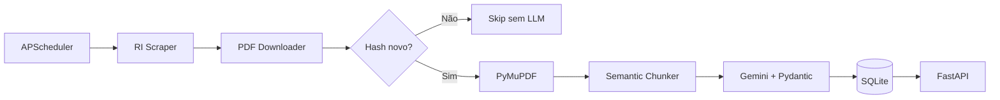
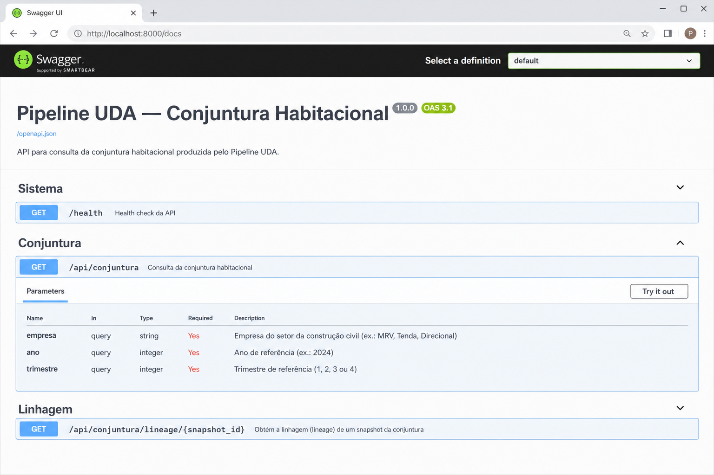

# Pipeline UDA — Conjuntura Habitacional

Pipeline de ingestão, extração semântica (LLM) e API REST para métricas operacionais do setor habitacional, a partir de PDFs de Relações com Investidores (RI) e Boletins de Conjuntura.

> Especificação original da atividade: [TAREFA.md](TAREFA.md)

---

## 1. Resumo

Solução end-to-end que:

1. **Observa** Centrais de Resultados de incorporadoras (polling agendado).
2. **Baixa** PDFs de Prévia Operacional e verifica duplicidade por **SHA-256** antes de acionar o LLM.
3. **Extrai** métricas via **Google Gemini** com saída estruturada (Pydantic).
4. **Persiste** no catálogo SQLite com **linhagem** (URL do PDF, página, chunk).
5. **Expõe** dados via **API REST** documentada no Swagger UI.

Validado com dois layouts distintos:

| Documento | Layout | Estratégia de chunking |
|-----------|--------|------------------------|
| `fixtures/Boletim_Conjuntura_2025_3T.pdf` | Tabela consolidada (1 página) | **Full-Scan** |
| `fixtures/MRV SA - Prévia Operacional - 1T26.pdf` | Apresentação em slides (13 páginas) | **Chunking semântico** |

---

## 2. Decisões de arquitetura

| Decisão | Escolha | Justificativa |
|---------|---------|---------------|
| Gatilho de ingestão | **Polling** (APScheduler, 1×/dia) | Simples, sem depender de RSS/webhooks nas páginas de RI |
| LLM | **Google Gemini** (`gemini-2.5-flash`) | Saída estruturada nativa via JSON Schema + Pydantic |
| Catálogo | **SQLite** | Zero infraestrutura extra; linhagem em tabelas relacionais |
| Parsing de PDF | **PyMuPDF** | Extração de texto bruto; sem regras fixas de coordenadas |
| Chunking | **Híbrido** | Full-Scan ≤ 8 páginas; slides longos segmentados por palavras-chave operacionais |
| Idempotência | **SHA-256** do binário | Evita reprocessamento e custo de API |

### Fluxo



### Estratégia de chunking

- **Full-Scan:** documentos com ≤ 8 páginas (ex.: Boletim 3T25, 1 página).
- **Chunking semântico:** documentos maiores; seleciona páginas com termos como *Vendas*, *Lançamentos*, *Dados Operacionais*, *VGV*, além das 2 primeiras páginas (metadados do período).

---

## 3. Estrutura do projeto

```
projeto-individual-4/
├── README.md              # este documento
├── TAREFA.md              # especificação do desafio
├── requirements.txt
├── .env.example
├── configs/companies.yaml # empresas e URLs da Central de Resultados
├── fixtures/              # PDFs de teste
├── docs/
│   ├── evidence/          # JSONs de evidência
│   └── images/            # capturas (Swagger)
├── data/
│   ├── pdfs/              # PDFs baixados (gitignore)
│   └── conjuntura.db      # catálogo (gitignore)
├── src/
│   ├── api/               # FastAPI
│   ├── catalog/           # SQLite + linhagem
│   ├── contracts/       # Contrato Semântico Pydantic
│   ├── extraction/        # PDF, chunking, Gemini
│   ├── ingestion/         # scraper, downloader, hasher
│   ├── pipeline.py        # orquestrador
│   └── scheduler.py       # polling agendado
└── tests/
```

---

## 4. Setup

### Pré-requisitos

- Python 3.12+
- Chave de API Gemini ([Google AI Studio](https://aistudio.google.com/app/apikey))

### Instalação

```bash
cd projeto-individual-4
python3 -m venv .venv
source .venv/bin/activate
pip install -r requirements.txt
cp .env.example .env
# Edite .env e preencha GEMINI_API_KEY
```

### Variáveis de ambiente (`.env`)

| Variável | Obrigatória | Descrição |
|----------|-------------|-----------|
| `GEMINI_API_KEY` | Sim | Chave da API Gemini |
| `GEMINI_MODEL` | Não | Modelo (default: `gemini-2.5-flash`) |
| `POLL_INTERVAL_HOURS` | Não | Intervalo do scheduler (default: `24`) |

---

## 5. Como rodar

### 5.1 Processar um PDF local

```bash
# Extrai, persiste no catálogo e exibe JSON
python -m src.pipeline process fixtures/Boletim_Conjuntura_2025_3T.pdf \
  --empresa MRV --ano 2025 --trimestre 3
```

Alternativa via CLI de extração:

```bash
python -m src.extraction.cli fixtures/Boletim_Conjuntura_2025_3T.pdf \
  --empresa MRV --ano 2025 --trimestre 3 --save
```

### 5.2 Polling das Centrais de Resultados

```bash
# Uma varredura imediata
python -m src.scheduler --once

# Ou via pipeline
python -m src.pipeline poll
```

Empresas configuradas em `configs/companies.yaml`: **MRV**, **Direcional**, **Tenda**.

### 5.3 Scheduler contínuo (polling diário)

```bash
python -m src.scheduler
# Executa imediatamente e repete a cada POLL_INTERVAL_HOURS (default 24h)
# Ctrl+C para encerrar
```

### 5.4 API REST

```bash
uvicorn src.api.main:app --reload --port 8000
```

| URL | Descrição |
|-----|-----------|
| http://localhost:8000/docs | **Swagger UI** (documentação interativa) |
| http://localhost:8000/redoc | ReDoc |
| http://localhost:8000/openapi.json | Esquema OpenAPI |

**Exemplos curl:**

```bash
curl "http://localhost:8000/api/conjuntura?empresa=MRV&ano=2025&trimestre=3"
curl "http://localhost:8000/api/conjuntura/lineage/1"
curl "http://localhost:8000/health"
```

Para parar o uvicorn: `Ctrl+C` no terminal.

### 5.5 Testes automatizados

```bash
pytest tests/ -v -m "not integration"
# 37 testes unitários

pytest tests/test_gemini_extractor.py -m integration -v
# Teste live com Gemini (requer API key)
```

---

## 6. API — Endpoints

| Método | Rota | Descrição |
|--------|------|-----------|
| `GET` | `/health` | Status da API e conexão com o banco |
| `GET` | `/api/conjuntura?empresa=&ano=&trimestre=` | Métricas + linhagem |
| `GET` | `/api/conjuntura/lineage/{snapshot_id}` | Detalhes de origem do dado |

### Swagger UI

Interface interativa gerada automaticamente pelo FastAPI:



Acesse localmente em **http://localhost:8000/docs** após subir a API.

---

## 7. Evidências de funcionamento

### 7.1 Testes automatizados

```
37 passed, 1 deselected
```

Cobertura: contrato Pydantic, catálogo/idempotência, PDF reader, chunking, pipeline, scraper, downloader e API.

### 7.2 Extração — Boletim MRV 3T25

Pipeline processou o Boletim e extraiu as variações percentuais corretas (`lanc_vs_tri_anterior: -32.0`, etc.).

Resposta da API (`GET /api/conjuntura?empresa=MRV&ano=2025&trimestre=3`):

```json
{
  "id": 1,
  "empresa": "MRV",
  "ano": 2025,
  "trimestre": 3,
  "lanc_vs_tri_anterior": -32.0,
  "lanc_vs_mesmo_tri_ano_ant": -19.0,
  "lanc_acum_9m_ano_ant": 96.0,
  "lanc_acum_9m_atual": 20.0,
  "vend_vs_tri_anterior": -12.0,
  "vend_vs_mesmo_tri_ano_ant": -10.0,
  "vend_acum_9m_ano_ant": 9.0,
  "vend_acum_9m_atual": -5.0,
  "url_origem": "local://fixtures/Boletim_Conjuntura_2025_3T.pdf",
  "hash_documento": "e53f30f5f67ebc739041680133ef33bedc87446cba7bb41ee9fbb0c4f3e65661",
  "data_processamento": "2026-06-13T06:40:25.527276",
  "lineage": [
    {
      "pdf_url": "local://fixtures/Boletim_Conjuntura_2025_3T.pdf",
      "pagina_origem": 1,
      "chunk_id": "full-scan"
    }
  ]
}
```

Arquivo completo: [docs/evidence/api_conjuntura_mrv_3t25.json](docs/evidence/api_conjuntura_mrv_3t25.json)

### 7.3 Idempotência (hash SHA-256)

Reprocessar o mesmo PDF **não aciona o Gemini**:

```json
{
  "status": "skipped",
  "empresa": "MRV",
  "hash_sha256": "e53f30f5f67ebc739041680133ef33bedc87446cba7bb41ee9fbb0c4f3e65661",
  "message": "Hash já existente no catálogo — LLM não acionado."
}
```

Arquivo: [docs/evidence/pipeline_idempotencia_skip.json](docs/evidence/pipeline_idempotencia_skip.json)

### 7.4 Dois layouts de PDF

| PDF | Páginas | Chunking | Resultado |
|-----|---------|----------|-----------|
| Boletim 3T25 | 1 | `full-scan` (1 chunk) | Variações % extraídas corretamente |
| Prévia MRV 1T26 | 13 | `semantic-chunks` (~7 páginas) | Pipeline executa; texto escasso em slides limita métricas absolutas* |

\* *Limitação conhecida:* slides com gráficos/tabelas renderizadas como imagem não expõem números ao PyMuPDF. OCR seria extensão futura.

### 7.5 Health check

```json
{
  "status": "ok",
  "database": "connected"
}
```

---

## 8. Contrato semântico

Campos principais extraídos pelo LLM (Pydantic → `src/contracts/conjuntura.py`):

**Variações percentuais (Boletim de Conjuntura):**
`lanc_vs_tri_anterior`, `lanc_vs_mesmo_tri_ano_ant`, `lanc_acum_9m_ano_ant`, `lanc_acum_9m_atual`, `vend_vs_tri_anterior`, `vend_vs_mesmo_tri_ano_ant`, `vend_acum_9m_ano_ant`, `vend_acum_9m_atual`

**Valores absolutos (Prévia Operacional):**
`vendas_unidades`, `vgv_milhoes`, `lancamentos_unidades`, `estoque_unidades`, `obras_andamento`, etc.

Regras no prompt: campos ausentes → `null`; proibido inferir; percentuais de marketing ignorados em prévias.

---

## 9. Riscos e limitações

| Risco | Mitigação adotada |
|-------|-------------------|
| Sites de RI mudam HTML | URLs por empresa em `configs/companies.yaml`; seletores isolados no scraper |
| Custo/latência Gemini | Chunking semântico + skip por hash |
| Alucinação do LLM | Contrato Pydantic estrito + prompt "null se não encontrar" |
| PDFs escaneados / slides gráficos | Documentado; OCR fora do escopo mínimo |
| Cota API Gemini | Usar `gemini-2.5-flash` no `.env` |

---

## 10. Checklist de entrega

- [x] Polling detecta/baixa PDFs sem reprocessar duplicatas (hash)
- [x] Extração funciona no Boletim 3T25 (tabela) e pipeline roda na Prévia MRV 1T26 (slides)
- [x] Valores salvos com linhagem (`url_origem`, `hash_documento`)
- [x] `GET /api/conjuntura?empresa=...&ano=...&trimestre=...` retorna JSON consistente
- [x] `.env`, `data/pdfs/` e `*.db` no `.gitignore`
- [x] Documentação operacional (este README) + especificação em TAREFA.md
